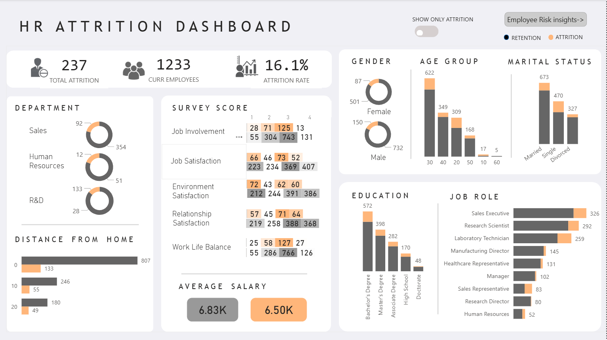
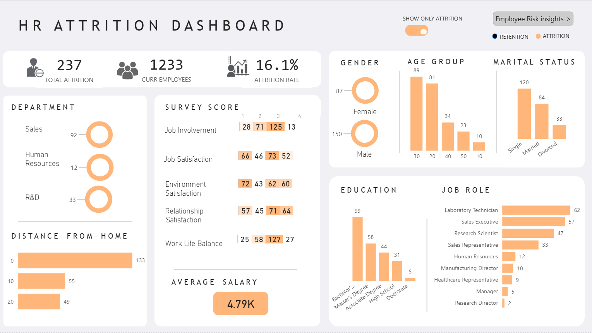
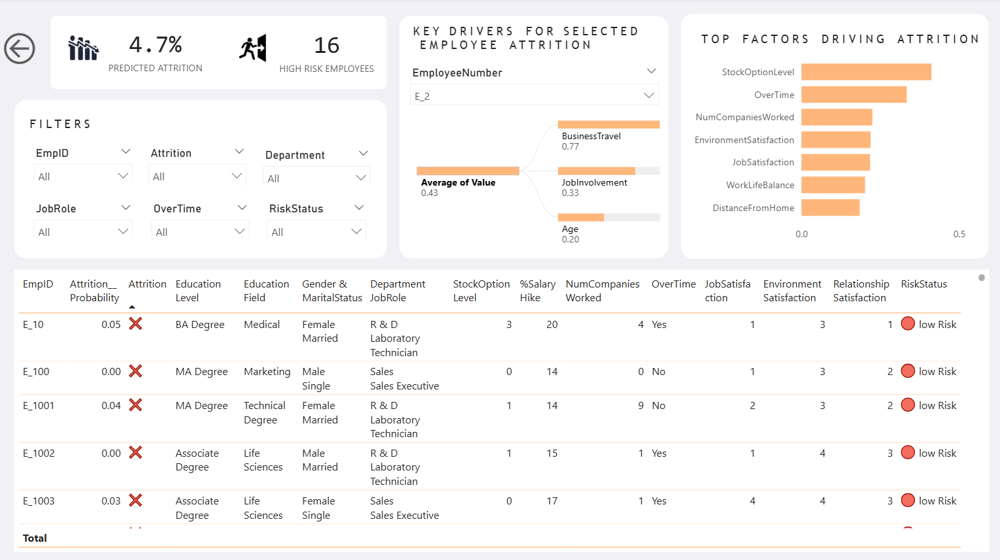

# HR-Attrition-Analysis-Prediction-Dashboard
## 📌 Project Overview

An end-to-end HR analytics project that predicts employee attrition using Machine Learning and explains predictions using SHAP.
An interactive Power BI dashboard is built to help HR teams identify high-risk employees and understand the key factors driving attrition at both global and individual levels.

## 📊 Dataset

  - IBM HR Analytics Employee Attrition Dataset( 1,470 employee records )
  - Target variable: Attrition (Yes / No)
  - Features include demographics, job role, satisfaction, performance, and compensation details

## 🧠 Machine Learning Workflow

   - Binary Classification (Attrition Prediction)
   - Imbalanced dataset
   -  Models Experimented
         Logistic Regression
         Decision Tree Classifier
         Support Vector Classifier
         Random Forest Classifier
         XGBoost Classifier (Final Model)
         Final Model Selection
  - XGBoost was selected due to better performance in identifying attrition cases after:
  - Handling class imbalance using scale_pos_weight
  - Threshold tuning based on F1-score
      
## 🔍 Model Explainability (SHAP)
  - SHAP (SHapley Additive exPlanations) is used to make predictions interpretable.
  - Global Explainability
  - Identifies top features influencing employee attrition across the organization
  - Employee-Level Explainability
  - Shows top factors driving attrition risk for each employee
  - Enables HR teams to understand why an employee is predicted as high risk

## 📊 Power BI Dashboard

  ### Dashboard Pages
   
   ### 1️⃣ Overview Dashboard
  - Key HR KPIs(Total Attrition, Total Employees, Attrition Rate)
  - Comparing attrition and retention by department, job role, gender, survey score, education, salary, and age
  - Shows only attrition by all these metrics on toggling

  ###  2️⃣ Prediction & Explainability Dashboard
  - Predicted attrition probability for each employee
  - Global top attrition drivers
  - Employee-specific top SHAP factors
  - Interactive employee filtering

## DashBoard Screenshots:

    
## 🛠️ Tech Stack

  - Python: Pandas, NumPy, Scikit-learn
  - Machine Learning: XGBoost
  - Explainability: SHAP
  - Notebook: Google Colab
  - Visualization: Power BI

## 🎯 Key Insights

  - Overall employee attrition rate stands at 16.1%.
  - Stock Option Level is the strongest attrition driver.Employees with stockoptionlevel with 0 accounts for 65% of total attrition
  - Research and development department records highest attrition contribution with 56%.
  - Employees wuith low environment satisfaction form the majority of attrition cases.
  - The trained ML model predicts an attrition risk of 4.7% among the current workforce.
  - 16 employees are high - risk candidates for potential attrition.

## 🚀 Key Learnings

  - Handling imbalanced datasets
  - Model evaluation beyond accuracy
  - Threshold tuning for business objectives
  - SHAP-based explainability
  - Integrating ML outputs into BI dashboards

## 👩‍💻 Author

  Pujitha Dumpa 
  Computer Science Engineering Student 
  Aspiring Data Analyst.
